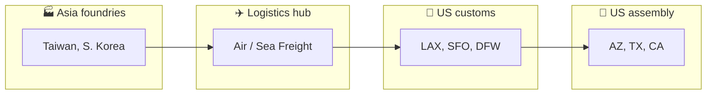
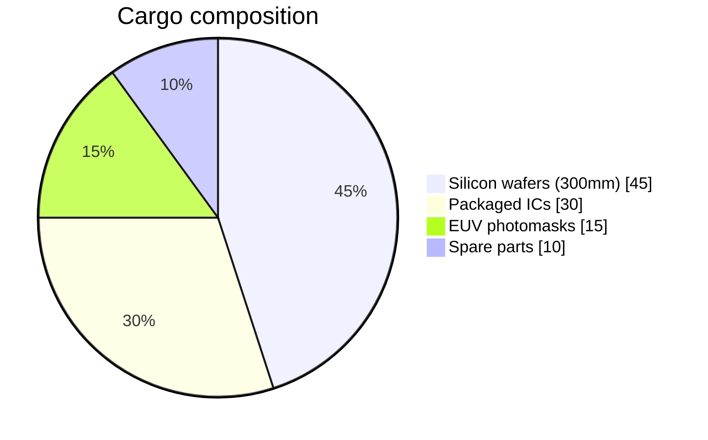

# Neural-Logix: Semiconductor Supply Hub

> **Reference:** [Gemini – direct access to Google AI](https://gemini.google.com/share/5ae03e9256c6)  
> **Source:** This infographic is derived from the interactive dashboard implemented in [`gemini_dataset_infographic.html`](gemini_dataset_infographic.html).

An AI-augmented live tracking and predictive operations dashboard designed for **Nvidia**, **Broadcom**, and **Intel**. Monitoring trans-Pacific silicon routes from Asian manufacturing hubs to US assembly locations.

---

## Trans-Pacific Node Architecture

The semiconductor lifecycle is highly distributed. Raw wafers and fabricated dies originate primarily in East Asian foundries (e.g. TSMC, Samsung). These are transported via secured, environmentally controlled freight to US facilities for final assembly, packaging, and integration by leading US tech giants.

| Stage | Description |
|--------|--------------|
| **Asia foundries** | Taiwan, South Korea — wafer and die production |
| **Logistics hub** | Air / sea freight |
| **US customs** | LAX, SFO, DFW |
| **US assembly** | Arizona, Texas, California |

---

## Shipment Profiles & Modality (Dataset 1)

Payload composition dictates transport mode and priority. High-value, temperature-sensitive items (EUV photomasks, bare wafers) use expedited air; standard raw materials use ocean freight.

### Cargo composition (in transit)

Distribution of part types currently in transit.

| Part type | Share |
|-----------|--------|
| Silicon wafers (300 mm) | **45%** |
| Packaged integrated circuits | **30%** |
| EUV photomasks | **15%** |
| Manufacturing spare parts | **10%** |

### Transport mode by priority

Logistics allocation by SLA criticality (stacked: air vs ocean vs ground).

| Priority | Air freight | Ocean freight | Ground / truck |
|----------|-------------|---------------|----------------|
| **Standard** | 15% | 70% | 15% |
| **High** | 75% | 5% | 20% |
| **Critical (AOG)** | 100% | 0% | 0% |

---

## Live Telemetry & Synthetic Risk Factors (Dataset 2)

Event logs and synthetic overlays. Microchips are sensitive to environmental shifts; we track temperature and humidity against strict tolerances. Synthetic data (geopolitical tension, severe weather) trains the AI to predict SLA violations before they occur.

### Environmental transit telemetry (last 24 h)

Monitoring temperature (°C) and humidity (%) for critical payload **SHP-89212**.

| Time | Temperature (°C) | Humidity (%) |
|------|-------------------|--------------|
| 00:00 | 18.0 | 40 |
| 04:00 | 18.5 | 41 |
| 08:00 | 19.0 | 40 |
| 12:00 | 22.0 | 45 |
| 16:00 | 19.5 | 50 |
| 20:00 | 18.2 | 42 |
| 24:00 | 18.0 | 40 |

### AI risk matrix: route distance vs predicted delay

Bubble size indicates composite risk score (weather anomalies, customs backlog, geopolitical friction).

| Route | Distance (km) | Predicted delay (h) | Risk context |
|-------|----------------|----------------------|--------------|
| Route A | 9,500 | 1.2 | Low risk |
| Route B | 10,200 | 3.5 | — |
| Route C | 11,500 | 8.4 | Typhoon warning |
| Route D | 9,800 | 2.1 | — |
| Route E | 12,100 | 9.5 | Geopolitics |
| Route F | 10,500 | 4.0 | — |
| Route G | 11,800 | 7.2 | — |
| Route H | 10,100 | 1.8 | — |

---

## Predictive Warehouse Fulfillment (Dataset 3)

US fulfillment centers balance inbound capacity with labor availability. The AI predicts 48-hour capacity bottlenecks so operations can reroute shipments or adjust dock utilization proactively.

### Facility efficiency radar

Comparing performance metrics across major US hubs (0–100 scale).

| Metric | Arizona hub (Intel) | Texas hub (Broadcom) |
|--------|----------------------|------------------------|
| Dock utilization | 85 | 70 |
| Labor availability | 90 | 60 |
| Processing speed | 75 | 85 |
| Storage capacity | 60 | 90 |
| Exception handling | 80 | 65 |

### Inventory vs 48 h predicted capacity

Identifying over-capacity flags to prevent unloading backlogs.

| Hub | Current inventory (units) | Predicted 48 h capacity |
|-----|---------------------------|---------------------------|
| AZ hub | 12,000 | 14,000 |
| TX hub | 18,000 | 17,500 |
| CA hub | 15,000 | 20,000 |
| OR hub | 9,000 | 10,000 |

*When current inventory approaches or exceeds predicted capacity, the system raises an over-capacity flag.*

---

## References

- **Gemini reference:** [https://gemini.google.com/share/5ae03e9256c6](https://gemini.google.com/share/5ae03e9256c6)
- **Source implementation:** [gemini_dataset_infographic.html](gemini_dataset_infographic.html) (Chart.js, Plotly; interactive dashboard)
